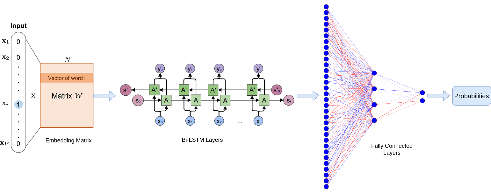
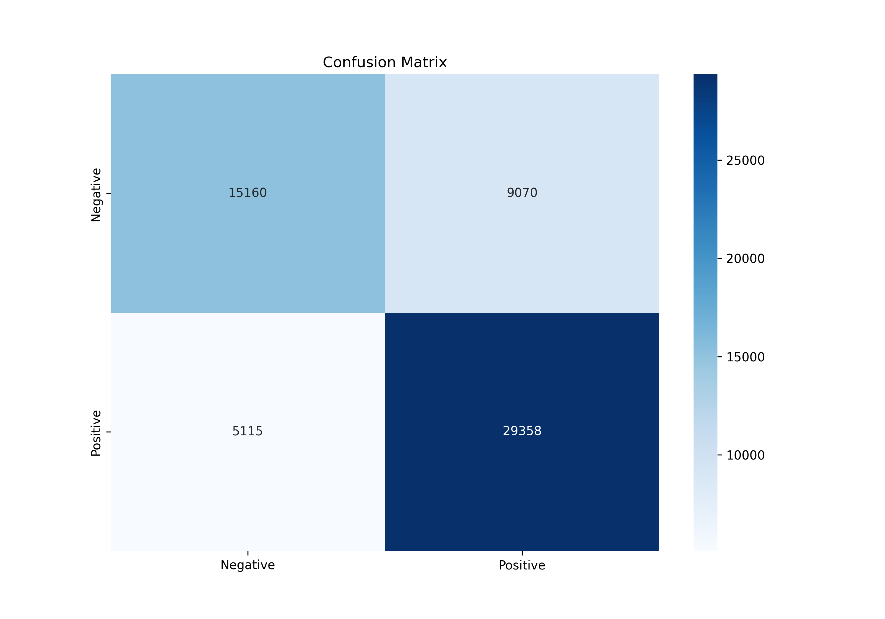
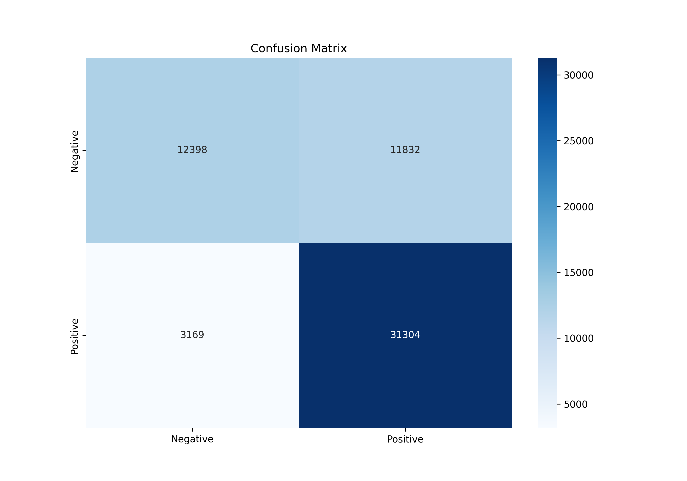
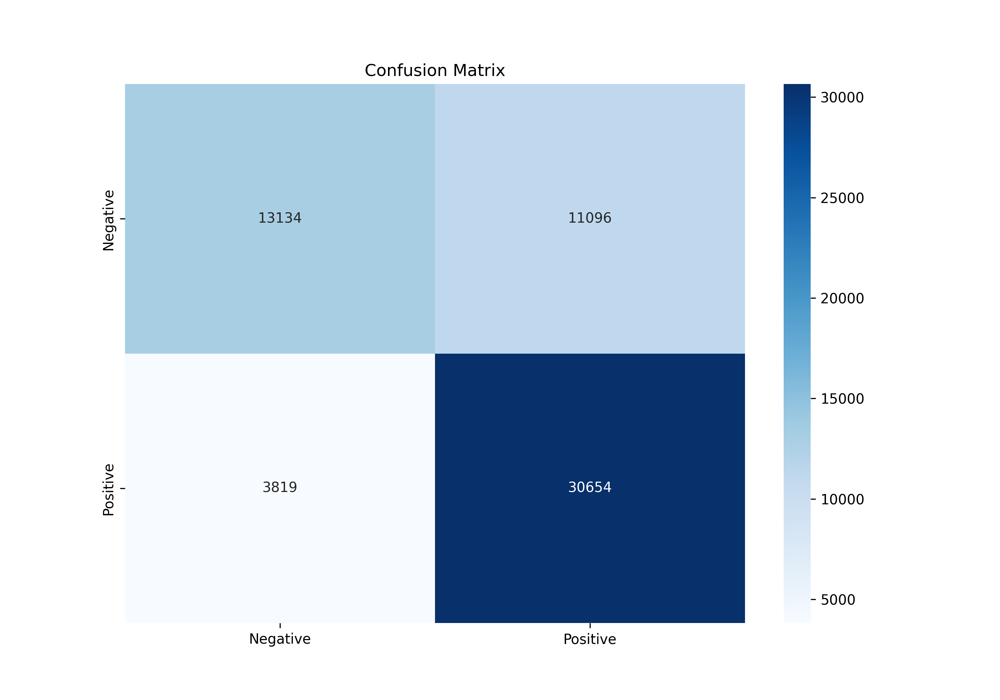
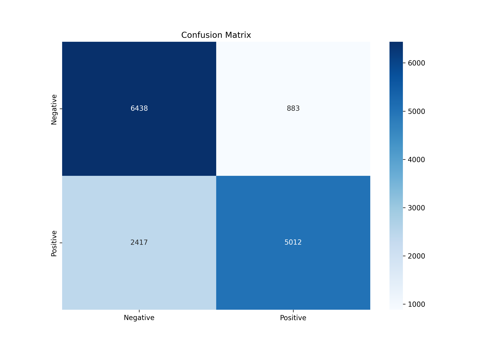
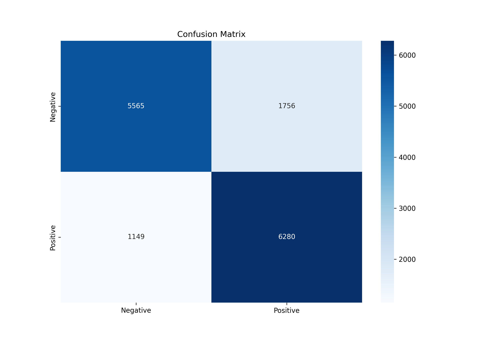
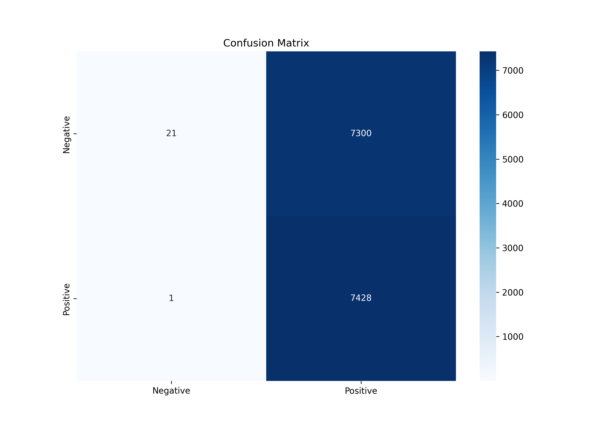

# Federated Learning for NLP Tasks

[](https://www.python.org/)
[](https://pytorch.org/)

---

This repository includes a Python implementation of Sentiment Analysis in Federated Settings using Neural Networks with PyTorch.

## Overview

- Framework used : Pytorch
- Dataset : [Sentiment140](https://www.kaggle.com/datasets/kazanova/sentiment140), [Large Movie Review Dataset](https://www.kaggle.com/datasets/lakshmi25npathi/imdb-dataset-of-50k-movie-reviews)

## Datasets
For generating results, we have utilized the Sentiment140 dataset and the Large Movie Review Dataset. Additionally, we employed pre-trained word vectors from [GoogleNews-vectors-negative300](https://code.google.com/archive/p/word2vec/).

Using these pre-trained word vectors ensured that the training process focused solely on the neural network, leaving the word embeddings unchanged throughout both server-side and user-side training.

We divided the data using scikit-learn into a 70-30 ratio for training and testing purposes.

### Data Preprocessing
We preprocess data to clean and standardize textual data for analysis or modeling. By handling negations, removing stop words, lemmatizing words, and eliminating duplicates, the text is prepared to be more informative and conducive to accurate analysis. This preprocessing enhances the quality of the text data, making it more suitable for natural language processing tasks.

Preprocessing for the Sentiment140 dataset can be performed using the following steps:
```shell
cd data
python3 preprocessing.py
```

For the IMDB dataset, follow these steps for preprocessing:
```python
import pandas as pd
from data.preprocessing import clean_text

df = pd.read_csv("./data/IMDB Dataset.csv")
df['cleaned_text'] = df.review.apply(lambda x: clean_text(x))
df.drop_duplicates(subset = ["cleaned_text"], keep = False, inplace = True)
df = df.rename(columns={'sentiment':'target'})
df.to_csv("./data/cleaned_imdb.csv", index=False)
```
Ensure to adjust paths and filenames accordingly before running the code.

### Generating Vocabulary

To generate the vocabulary, follow these steps:
```python
# For Sentiment140
from data.datasets import TweetSentimentDataset

ds = TweetSentimentDataset("./data/cleaned_data.csv", vocab_file='vocab.json')

# For IMDB
from data.datasets import ImdbSentimentDataset

ds = ImdbSentimentDataset("./data/cleaned_imdb.csv", vocab_file='vocab_imdb.json')
```
Ensure to replace ./data/cleaned_data.csv and ./data/cleaned_imdb.csv with the paths to your cleaned data files.

## Architecture

### LSTM based Model
For model selection, we utilize the bidirectional LSTM architecture.


## Results
### Sentiment140

- Baseline

  

- IID

  

- NON-IID with beta=0.6

  

### IMDB Dataset

- Baseline

  

- IID

  

- NON-IID with beta=0.6

  

## Related Projects
For a similar implementation of federated learning applied to Image Classification, please refer to [this repository](https://github.com/Atul-AI08/Federated-Learning-for-Image-Classification).

# References

- Dataset

```bibtex
@ONLINE {Sentiment140,
    author = "Go, Alec and Bhayani, Richa and Huang, Lei",
    title  = "Twitter Sentiment Classification using Distant Supervision",
    year   = "2009",
    url    = "http://help.sentiment140.com/home"
}
```

```
@InProceedings{maas-EtAl:2011:ACL-HLT2011,
  author    = {Maas, Andrew L.  and  Daly, Raymond E.  and  Pham, Peter T.  and  Huang, Dan  and  Ng, Andrew Y.  and  Potts, Christopher},
  title     = {Learning Word Vectors for Sentiment Analysis},
  booktitle = {Proceedings of the 49th Annual Meeting of the Association for Computational Linguistics: Human Language Technologies},
  month     = {June},
  year      = {2011},
  address   = {Portland, Oregon, USA},
  publisher = {Association for Computational Linguistics},
  pages     = {142--150},
  url       = {http://www.aclweb.org/anthology/P11-1015}
}
```
